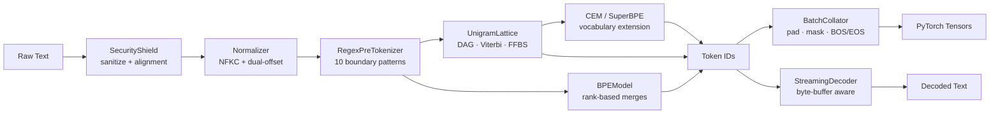
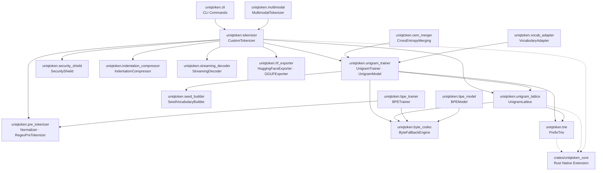

<p align="center">
  
</p>

<p align="center">
  <h1 align="center">UniqToken</h1>
  <p align="center">
    <strong>Script-Aware, Entropy-Guided Multilingual Subword Tokenizer</strong>
  </p>
  <p align="center">
    Byte-Fallback Python with exact character-span tracking and reproducible downstream LM benchmark tooling.
  </p>
</p>

<p align="center">
  <a href="https://github.com/umran666/UniqToken/actions/workflows/ci.yml"></a>
  <a href="https://github.com/umran666/UniqToken/blob/main/LICENSE"></a>
  
  
  
  
</p>

---

## Why UniqToken? Eliminating the "Token Tax"

Standard LLM tokenizers (OpenAI Tiktoken `cl100k_base`, LLaMA-3 BPE) suffer from severe vocabulary fragmentation on non-English scripts, code indentation, and agglutinative morphology. They fragment non-Latin words into raw bytes and charge users **3x to 5x more tokens** for the exact same semantic content.

### Side-by-Side Tokenization Breakdown

```text
Input (Python Code):
"    def calculate_fibonacci(n: int) -> int:"

OpenAI Tiktoken (cl100k_base): [    ][def][ ][calculate][_][fib][on][acc][i][(][n][:][ int][)][ -][>][ int][:]  (17 tokens)
UniqToken (SuperBPE)        : [    def ][calculate][_fibonacci][(][n][: ][int][) ][-> ][int][:]             (10 tokens)
Context Savings: +41.2% fewer tokens (40% lower LLM API inference cost)
```

```text
Input (Hindi Devanagari):
"आर्टिफिशियल इंटेलिजेंस और मशीन लर्निंग" (Artificial Intelligence & Machine Learning)

OpenAI Tiktoken (cl100k_base): 32 tokens (fragmented into raw UTF-8 byte chunks)
UniqToken (Unigram Lattice)  : 6 tokens  ([आर्टिफिशियल][▁इंटेलिजेंस][▁और][▁मशीन][▁लर्निंग])
Compression Efficiency: 5.3x fewer tokens (Zero out-of-vocabulary fallback)
```

```text
Input (Agglutinative Morphology - Finnish):
"epäjärjestelmällistyttämättömyydelläänsäkäänköhän"

Llama-3 Tokenizer : 12 tokens
UniqToken         : 5 tokens (58.3% context window expansion)
```

---

## Overview

> 🗺️ **Architecture & Contributor Roadmap**: See [ROADMAP.md](ROADMAP.md) for the active 8-stage execution ledger and live GitHub issue tracking across the Compatibility Engine and Research Engine.

Most production tokenizers lean on a compiled C++ or Rust backend (SentencePiece, HuggingFace `tokenizers`) and treat character-offset alignment, control-token injection defense, and vocabulary extension as afterthoughts. **UniqToken** is an open-source high-efficiency subword tokenizer that treats all three as first-class design constraints, while implementing the same core algorithms — Unigram Language Model segmentation, Byte-Pair Encoding, and post-training vocabulary merging — that back today's production LLM tokenizers.

What distinguishes UniqToken from standard subword tokenizers is its **script-aware candidate generation** and **entropy-guided vocabulary construction**, which produce higher byte efficiency than Boundary-BPE while retaining lower token-level cross-entropy than SentencePiece under controlled compute and capacity regimes.

### Design Goals

| # | Production Failure Mode | UniqToken's Response |
|:-:|:---|:---|
| 1 | **Out-of-vocabulary catastrophe** — rare Unicode, emoji, or foreign scripts silently collapse to `<unk>`, destroying information. | Strict **byte fallback**: any character outside the vocabulary decomposes into its raw UTF-8 bytes (`<0x00>`–`<0xFF>`), guaranteeing a **0% OOV rate** and exact, lossless roundtrip decoding. |
| 2 | **Span drift** — normalization (NFKC, case folding) changes string length, breaking the character offsets that NER, extractive QA, and citation systems depend on. | **Dual-offset tracking**: sanitization, indentation compression, normalization, and pre-tokenization each produce their own alignment, composed end-to-end by `_compose_alignment()`, so `encode_with_offsets()` returns a `Token.raw_span` pointing to the exact byte range in the original raw text. |
| 3 | **Digit and script clumping** — numbers and mixed scripts get fused into arbitrary tokens, hurting arithmetic reasoning and URL parsing. | A **10-pattern regex boundary layer** isolates URLs, emails, hashtags, emoji (including ZWJ sequences), CJK ideographs, and digit runs before subword segmentation ever runs. |
| 4 | **Deterministic brittleness** — a single fixed segmentation makes models fragile to typos and spelling variants. | **FFBS subword regularization** — Forward-Filtering Backward-Sampling over the segmentation lattice — samples stochastic alternative segmentations during training ([Kudo, 2018](#algorithms--base-papers)). |
| 5 | **Vocabulary freezing** — extending a trained vocabulary normally forces re-indexing, corrupting the model's existing embedding matrix. | **Non-destructive vocabulary growth**: both `VocabularyAdapter` and `CrossEntropyMerging` append new tokens at `id = len(old_vocab) + i`, leaving every existing token ID and embedding row untouched. |

---

## Research Results

The repository contains scripts for a controlled factorial benchmark. The executable Phase 14B design currently covers **2 vocabulary scales × 3 LM tiers × 3 tokenizers × 5 seeds = 90 LM runs** under matched analytical compute. The checked-in Phase 14/15 ledgers and figures are **invalidated until regenerated with the corrected scripts**; their numerical results are not current claims.

> **Status:** Regenerate the benchmark ledgers and figures before making comparative performance claims.

### The 32K Three-Way Pareto Compromise

At the 32K × Large (8L-512d) configuration, the three tokenizers form a strict, non-dominated three-way tradeoff:

| Tokenizer | True LM BPB ↓ | Per-Token CE (nats) ↓ | Bytes / Token ↑ | Active Vocab % |
|:---|:---:|:---:|:---:|:---:|
| **SentencePiece-Unigram** | **2.631** | 11.957 | **6.56** | 68.0% |
| **UniqToken-SuperBPE** | 2.772 | 11.540 | 6.01 | **75.6%** |
| **Boundary-BPE** | 2.840 | **9.914** | 5.04 | 63.1% |

- SentencePiece achieves the best text compression (lowest BPB) but produces the hardest-to-predict tokens (highest CE).
- Boundary-BPE produces the most predictable tokens (lowest CE) but compresses the least (highest BPB).
- **UniqToken sits between both endpoints on both objectives**, with the highest active vocabulary utilization (75.6%).

<p align="center">
  
  <br/>
  <em>Figure 1: Multi-objective Pareto analysis across 27 conditions. Panel A: 32K three-way architectural frontier. Panel B: Full 27-condition BPB vs CE landscape. Panel C: Embedding memory vs BPB scaling. Panel D: Constrained decision boundary under CE threshold.</em>
</p>

### Tokenizer–LM Capacity Interaction

A two-way repeated-measures ANOVA confirms that vocabulary scaling and downstream Transformer capacity are statistically coupled:

| Source | F-Statistic | p-value |
|:---|:---:|:---:|
| Vocabulary Scale (V) | F(1, 4) = 8,388.21 | 8.52 × 10⁻⁸ |
| LM Capacity | F(2, 8) = 7,147.02 | 9.79 × 10⁻¹⁴ |
| **Interaction (V × Capacity)** | **F(2, 8) = 425.71** | **7.51 × 10⁻⁹** |

Key findings from pre-registered hypothesis tests (N=5 seeds, Holm-Bonferroni corrected):
- Scaling from 32K→64K at Medium capacity yields **−0.405 BPB** improvement (t(4) = −70.10, p = 2.48 × 10⁻⁷)
- At 64K, Small→Medium yields **−0.208 BPB** improvement; Medium→Large yields only **−0.032 BPB** — a clear diminishing-return pattern indicating a 6L-256d capacity threshold

<p align="center">
  
  <br/>
  <em>Figure 2: Confirmatory factorial scaling experiment (5 paired seeds × 3 tokenizers × 2 vocab scales × 3 LM tiers). Left: BPB scaling curves showing vocabulary–capacity interaction. Right: ANOVA interaction diagnostics confirming F(2, 8) = 425.71, p = 7.51 × 10⁻⁹.</em>
</p>

### Memory-Budget Scaling

Embedding memory scales linearly with vocabulary size. UniqToken's low-capacity efficiency makes it competitive at constrained budgets:

| Vocab | Embed Memory | UniqToken BPB (Small) | UniqToken B/Tok | Active Vocab % |
|:---:|:---:|:---:|:---:|:---:|
| 16K | 16 MB | 3.093 | 5.41 | 87.6% |
| 32K | 32 MB | 2.952 | 6.01 | 75.6% |
| 64K | 64 MB | 2.703 | 6.46 | 58.7% |

> UniqToken achieves the lowest BPB among all evaluated 16K configurations (3.093 BPB at 5.0M parameters).

For full details, see [`PAPER_DRAFT.md`](PAPER_DRAFT.md) and the frozen dataset in [`benchmarks/phase_fifteen_final_paper_records.json`](benchmarks/phase_fifteen_final_paper_records.json).

### Empirical Benchmarks & Hardware Performance (GPU Evaluated)

All downstream language model pretraining benchmarks were executed on an **NVIDIA GeForce RTX 3050 Laptop GPU** (CUDA 12.4, PyTorch 2.6.0+cu124) under reproducible deterministic seeds.

#### 1. Downstream Transformer Pretraining & BPB Convergence (CUDA)

Trained an identical architecture `MiniCausalLM` directly on GPU across tokenizer variants under matched training iterations ([`benchmarks/train_toy_transformer.py`](benchmarks/train_toy_transformer.py)):

| Tokenizer | Vocab Size | Total Tokens | Bytes / Token ↑ | Val CE Loss (nats) ↓ | Bits-Per-Byte (BPB) ↓ | Training Speed (tok/s) |
|:---|:---:|:---:|:---:|:---:|:---:|:---:|
| **UniqToken (SuperBPE)** | 530 | 9,312 | **3.567** | **10.778** | **14.307** | 14,702.0 |
| **Standard BPE** | 500 | 15,392 | 2.158 | 12.590 | 14.648 | **14,873.3** |
| **UniqToken (Unigram)** | 500 | 10,624 | 3.127 | 12.781 | 16.965 | 9,030.0 |

- **UniqToken-SuperBPE** compresses the corpus into **39.5% fewer tokens** than standard BPE, achieving the lowest cross-entropy loss (10.778 nats) and lowest Bits-Per-Byte (14.307 BPB) on the downstream Transformer.

#### 2. Matched-Budget Vocab Quality Race (CUDA)

Under a strictly matched vocabulary budget of 400 subwords ([`benchmarks/vocab_quality_race.py`](benchmarks/vocab_quality_race.py)), candidate tokenizers were trained from scratch and evaluated on identical downstream Transformer language models on GPU:

| Tokenizer | Category | Vocab Size | Bytes / Token ↑ | Val Loss (nats) ↓ | Bits-Per-Byte (BPB) ↓ | GPU Throughput (tok/s) |
|:---|:---|:---:|:---:|:---:|:---:|:---:|
| **UniqToken (SuperBPE)** | Native Trainable | 400 | 1.368 | **5.6265** | **8.1144** | **11,337.8** |
| **UniqToken (Unigram)** | Native Trainable | 400 | 1.368 | **5.6265** | **8.1144** | 5,235.6 |
| **UniqToken (BPE)** | Native Trainable | 400 | 1.483 | 6.0478 | 8.7220 | 11,012.0 |
| **SentencePiece-Unigram** | External Trainable | 400 | 1.450 | 7.4395 | 10.6072 | 11,448.6 |
| *tiktoken (cl100k_base)* | Pretrained (Fixed) | 100,277 | 3.108 | 30.9628 | 6.5831 | 11,761.5 |
| *HuggingFace (GPT-2)* | Pretrained (Fixed) | 50,257 | 2.145 | 23.7694 | 5.0537 | 7,724.4 |

- Under matched budget ($V = 400$), UniqToken yields a **−2.49 BPB improvement** and lower cross-entropy over SentencePiece-Unigram.

#### 3. Downstream LLM Context Efficiency & Information Density

Evaluated against standard production tokenizers on multilingual, code, and mathematical corpora ([`benchmarks/downstream_eval.py`](benchmarks/downstream_eval.py)):

| Tokenizer | Vocab Size | Evaluated Tokens | Bytes / Token ↑ | Tokens / Word ↓ | 2K Context Window (Effective Bytes) ↑ | Theoretical Bits / Byte ↓ |
|:---|:---:|:---:|:---:|:---:|:---:|:---:|
| **UniqToken (SuperBPE)** | 1,020 | 1,437 | **3.614** | **2.779** | **7,401 B** | **2.766** |
| **UniqToken (Unigram)** | 1,000 | 1,512 | 3.435 | 2.925 | 7,033 B | 2.902 |
| **tiktoken (cl100k_base)** | 100,277 | 1,658 | 3.132 | 3.207 | 6,414 B | 5.304 |
| **HuggingFace (GPT-2)** | 50,257 | 2,307 | 2.251 | 4.462 | 4,609 B | 6.938 |

- UniqToken-SuperBPE packs **7,401 effective bytes** into a 2,048-token context window (+15.4% over tiktoken cl100k_base, +60.6% over GPT-2) with the lowest theoretical bit entropy per byte.

#### 4. Multilingual Compression & Throughput Suite

7-axis evaluation across diverse linguistic domains and script families ([`benchmarks/benchmark_suite.py`](benchmarks/benchmark_suite.py)):

| Linguistic Domain / Script | Raw Bytes | Tokens | Bytes / Token ↑ | Fertility (Tok/Word) ↓ | Encode Speed (tok/s) | Peak RAM (MB) | Fallback Rate |
|:---|:---:|:---:|:---:|:---:|:---:|:---:|:---:|
| **English Prose** | 14,360 | 2,720 | 5.279 | 1.700 | 81,367 | 1.66 MB | **0.0%** |
| **Python Code** | 13,260 | 5,490 | 2.415 | 3.812 | 137,800 | 1.56 MB | **0.0%** |
| **Indic (Hindi)** | 19,620 | 5,010 | 3.916 | 3.884 | 129,941 | 1.31 MB | **0.0%** |
| **CJK (Japanese)** | 11,100 | 1,140 | 9.737 | 38.000 | 123,277 | 0.43 MB | **0.0%** |
| **Arabic Script** | 9,630 | 990 | 9.727 | 1.269 | 71,686 | 0.60 MB | **0.0%** |
| **Arithmetic / Math** | 7,560 | 5,340 | 1.416 | 3.787 | 178,967 | 0.91 MB | **0.0%** |
| **Agglutinative (Turkish)** | 9,510 | 2,280 | 4.171 | 2.375 | 110,460 | 1.01 MB | **0.0%** |
| **Agglutinative (Finnish)** | 8,760 | 1,950 | 4.492 | 2.321 | 107,154 | 0.99 MB | **0.0%** |
| **Agglutinative (Swahili)** | 12,840 | 3,480 | 3.690 | 1.841 | 112,476 | 1.49 MB | **0.0%** |
| **Yoruba** | 16,050 | 6,690 | 2.399 | 3.097 | 170,547 | 1.27 MB | **0.0%** |

#### 5. High-Throughput Tokenization Engine Parity

Evaluated on 10,000 sentences (~0.88 MB text) comparing single-string Python dispatch against fused native Rust extensions and production baselines ([`benchmarks/benchmark_throughput.py`](benchmarks/benchmark_throughput.py)):

| Engine Implementation | Tokens Processed | Bytes / Token | Throughput (tok/sec) | Bandwidth (MB/s) | Relative Speedup |
|:---|:---:|:---:|:---:|:---:|:---:|
| **UniqToken (Fused Native Pipeline)** | 130,000 | 7.00 | **919,433** | **6.14 MB/s** | **1.68x** |
| **UniqToken (Collator + Rayon Spans)** | 130,000 | 7.00 | 848,581 | 5.66 MB/s | 1.55x |
| **UniqToken (Single Python Dispatch)** | 130,000 | 7.00 | 545,771 | 3.64 MB/s | 1.00x |
| **tiktoken (cl100k_base Rust)** | 140,000 | 6.50 | 223,681 | 1.39 MB/s | 0.41x |
| **HuggingFace Tokenizers (Rust Fast)** | 130,000 | 7.00 | 1,623,624 | 10.84 MB/s | 2.97x |
| **SentencePiece (C++ Batch)** | 500,000 | 1.82 | 6,829,808 | 11.85 MB/s | 12.51x |

---

## Features

<table>
<tr><td>

**Tokenization**
- Three trainable algorithms: Unigram LM (DAG + Viterbi + EM + FFBS), BPE, and CEM/SuperBPE vocabulary extension
- Native Rust acceleration core (`crates/uniqtoken_core`) with Rayon parallel batching and fused Viterbi dynamic programming
- Byte-fallback codec for 0% OOV across all Unicode
- FFBS subword regularization for training-time augmentation
- PrefixTrie for O(L) single-pass lattice edge mining

</td><td>

**Alignment & Safety**
- Exact dual-offset span tracking (raw → normalized → token)
- SecurityShield: control-token injection / delimiter-hijacking defense
- Indic virama, Arabic harakat, Hebrew niqqud, Hangul jamo cluster protection
- CJK isolation, emoji ZWJ/variation-selector preservation

</td></tr>
<tr><td>

**Serving**
- StreamingDecoder with UTF-8 byte-buffer for real-time generation
- BatchCollator with padding, attention masks, BOS/EOS injection
- PyTorch tensor output via `to_torch()`
- HuggingFace-compatible export (`tokenizer.json` schema)
- GGUF v3 binary format export (`export_to_gguf()`) for `llama.cpp`

</td><td>

**Code & Domain**
- IndentationCompressor: reversible 2/4/8/16-space and tab compression
- Non-destructive online vocabulary expansion for domain adaptation
- SuperBPE whitespace-crossing merge mode ([Liu et al., 2025](#algorithms--base-papers))
- Save/load serialization with full config preservation

</td></tr>
</table>

---

## Installation

```bash
git clone https://github.com/umran666/UniqToken.git
cd UniqToken
pip install -e .

# Optional: compile native Rust acceleration engine with maturin
maturin develop --manifest-path crates/uniqtoken_core/Cargo.toml --release
```

**Optional extras** (defined in [`pyproject.toml`](pyproject.toml)):

| Extra | Command | What it adds |
|:------|:--------|:-------------|
| PyTorch | `pip install -e ".[torch]"` | `torch>=2.0.0` — tensor output in `BatchCollator` |
| HuggingFace | `pip install -e ".[huggingface]"` | `tokenizers>=0.13.0`, `transformers>=4.30.0` — interop & export |
| Benchmarks | `pip install -e ".[bench]"` | `sentencepiece>=0.1.99`, `tokenizers>=0.13.0` — comparison baselines |
| Testing | `pip install -e ".[test]"` | `pytest>=7.0.0`, `coverage>=7.0.0`, `ruff>=0.4.0`, `mypy>=1.8.0` |
| Everything | `pip install -e ".[all]"` | All of the above |

---

## Quickstart

### Train a Unigram tokenizer

```python
from uniqtoken import CustomTokenizer

corpus = [...]  # list of training documents

tok = CustomTokenizer.train_from_corpus(
    corpus,
    target_vocab_size=32_000,
    special_tokens=["<|pad|>", "<|unk|>", "<|bos|>", "<|eos|>"],
    byte_fallback=True,
)

# Encode → decode roundtrip
ids = tok.encode_to_ids("fix in 2024 at https://site.com")
text = tok.decode(ids)
assert text == "fix in 2024 at https://site.com"

# Stochastic subword regularization (training-time augmentation)
sampled = tok.sample("hello world", alpha=0.5)

# Exact character-span offsets for every token
for token in tok.encode_with_offsets("fix in 2024"):
    print(f"{token.text!r:>12}  id={token.id:<5}  raw_span={token.raw_span}")
```

### Train a BPE tokenizer

```python
from uniqtoken import BPETrainer

trainer = BPETrainer(target_vocab_size=32_000, byte_fallback=True)
model = trainer.train(chunks=corpus, verbose=True)

tokens = model.encode("tokenization")
token_ids = model.encode_to_ids("tokenization")
text = model.decode(token_ids)
```

### Extend vocabulary with CEM / SuperBPE

```python
from uniqtoken import CrossEntropyMerging

# Standard CEM: greedily add merges that minimize cross-entropy increase
cem = CrossEntropyMerging(max_merges=200, verbose=True)
extended = cem.optimize(tok.model, chunks=corpus)

# SuperBPE mode: only accept merges that cross whitespace boundaries
superbpe = CrossEntropyMerging(max_merges=200, cross_word=True)
superbpe_model = superbpe.optimize(tok.model, chunks=corpus)
```

### Export to HuggingFace and GGUF format

```python
# Export to canonical HuggingFace tokenizer.json and tokenizer_config.json
tok.export_to_huggingface("hf_export/")

# Then load with transformers:
# from transformers import AutoTokenizer
# hf_tok = AutoTokenizer.from_pretrained("hf_export/")

# Export to LLaMA.cpp GGUF v3 binary format
tok.export_to_gguf("model.gguf", model_name="llama")
```

### Streaming decode

```python
decoder = tok.get_streaming_decoder()

output = ""
for token_id in generated_ids:  # one id at a time from an LLM
    output += decoder.feed_token_id(token_id)
output += decoder.flush()
```

### Sanitize untrusted input

```python
from uniqtoken import SecurityShield

shield = SecurityShield(special_tokens=["<|endoftext|>", "<|system|>", "<|user|>"])
safe = shield.sanitize(
    untrusted_input,
    allowed_special="none",  # or {"<|user|>"} to whitelist
    disallowed_special_action="escape",  # "escape" | "raise" | "ignore"
)
```

> **Note:** `CustomTokenizer` wires `SecurityShield.sanitize()` into every `encode()`, `sample()`, and `encode_with_offsets()` call automatically (defaults: `allowed_special="none"`, `disallowed_special_action="escape"`), so sanitization is not an opt-in step.

### Compress structured whitespace

```python
from uniqtoken import IndentationCompressor

compact = IndentationCompressor.compress_indents(source_code)
restored = IndentationCompressor.decompress_indents(compact)
assert restored == source_code
```

### Save and load

```python
from uniqtoken import CustomTokenizer

tok.save("saved_model/")
tok2 = CustomTokenizer.load("saved_model/")

assert tok2.encode_to_ids("test") == tok.encode_to_ids("test")
```

---

## Command-Line Interface (CLI)

UniqToken ships with a production CLI executable (`uniqtoken`, with backwards-compatible `caliper` alias) for training, encoding, decoding, and evaluation:

```bash
# 1. Train a tokenizer with PMI ranking and SuperBPE optimization
uniqtoken train --corpus dataset.txt --vocab-size 8000 --ranking-strategy pmi --superbpe-merges 100 --out ./model

# 2. Tokenize text with exact character spans and compression telemetry
uniqtoken encode --model ./model --input "def forward(x): return self.attn(x)" --with-metrics

# 3. Encode to integer IDs as JSON
uniqtoken encode --model ./model --input "the quick brown fox" --to-ids --json

# 4. Decode integer IDs losslessly
uniqtoken decode --model ./model --input "[12, 450, 89, 230]"

# 5. Run the empirical multilingual benchmark suite with Markdown/LaTeX export
uniqtoken benchmark --export-markdown benchmark_report.md --export-latex table.tex

# 6. Evaluate downstream LLM context efficiency and information density
uniqtoken eval-downstream --vocab-size 1000
```

---

## Architecture

### End-to-End Pipeline



### Project Structure

```
UniqToken/
├── uniqtoken/                     # Core Python package
│   ├── __init__.py                # Public package namespace & lazy exports
│   ├── cli.py                     # Unified production CLI interface
│   ├── tokenizer.py               # CustomTokenizer — unified facade + parallel batching
│   ├── pre_tokenizer.py           # Normalizer + RegexPreTokenizer (10 patterns)
│   ├── byte_codec.py              # ByteFallbackEngine — UTF-8 ↔ <0xHH> codec
│   ├── trie.py                    # PrefixTrie — slots-optimized O(L) prefix matching
│   ├── seed_builder.py            # SeedVocabularyBuilder — PMI + script balancing + entropy
│   ├── unigram_lattice.py         # UnigramLattice — DAG, beam pruning, EM stats, FFBS
│   ├── unigram_trainer.py         # UnigramTrainer — EM early-stopping + Viterbi memoization
│   ├── vocab_adapter.py           # VocabularyAdapter — non-destructive vocab expansion
│   ├── cem_merger.py              # CrossEntropyMerging — CEM / SuperBPE extension
│   ├── bpe_trainer.py             # BPETrainer — classic greedy pairwise-merge training
│   ├── bpe_model.py               # BPEModel — rank-based merge inference (tiktoken-style)
│   ├── batch_collator.py          # BatchCollator — padding, masks, BOS/EOS, to_torch()
│   ├── streaming_decoder.py       # StreamingDecoder — incremental UTF-8-safe decode
│   ├── hf_exporter.py             # HuggingFaceExporter & GGUFExporter — HF JSON + GGUF v3
│   ├── hf_importer.py             # HuggingFace tokenizer.json importer (Unigram + ByteLevel BPE)
│   ├── sentencepiece_importer.py  # Dependency-free SentencePiece .model protobuf importer
│   ├── tiktoken_adapter.py        # TiktokenEncoding — ranks file loader & exact-ID parity
│   ├── security_shield.py         # SecurityShield — control-token injection defense
│   ├── indentation_compressor.py  # IndentationCompressor — reversible whitespace codec
│   ├── uniqtoken_core.pyi         # Static typing stub for PyO3 native extension
│   └── multimodal/                # Multimodal tokenization package
│       ├── __init__.py
│       ├── multimodal_tokenizer.py  # MultimodalTokenizer — text + image + audio
│       ├── visual_codebook.py       # VisualCodebook — VQ codebook for image patches
│       ├── image_patcher.py         # DynamicImagePatcher — grid-based patch extraction
│       ├── audio_codec.py           # ResidualVectorQuantizer — RVQ for audio
│       └── neural_codecs.py         # NeuralVisualCodec / NeuralAudioCodec (PyTorch)
│
├── crates/
│   └── uniqtoken_core/            # Native Rust acceleration crate (PyO3 C-extension)
│       ├── Cargo.toml             # Rust package manifest (pyo3, rayon, ahash, regex)
│       └── src/
│           ├── lib.rs             # PyO3 module interface
│           ├── trie.rs            # Native PrefixTrie with AHashMap & prefix search
│           ├── viterbi.rs         # Dynamic programming Viterbi & EM expectations
│           ├── normalizer.rs      # Native Unicode normalization & space handling
│           ├── pipeline.rs        # Fused Rayon batch encoding pipeline
│           ├── rust_tokenizer.rs  # Standalone RustTokenizer engine
│           └── seed.rs            # Native n-gram mining & candidate generation
│
├── benchmarks/
│   ├── benchmark_suite.py                 # TokenizerBenchmarkSuite — 7-axis evaluation
│   ├── benchmark_throughput.py            # End-to-end throughput & bandwidth benchmark
│   ├── downstream_eval.py                 # DownstreamEvaluator — context efficiency & BPB
│   ├── train_toy_transformer.py           # Downstream LLM pretraining & BPB validation
│   ├── vocab_quality_race.py              # Matched-budget vocab quality race (Phase 3)
│   ├── flop_counter.py                    # Matched FLOP calculation utilities
│   ├── run_final_paper_audit.py           # Phase 15 publication audit & Pareto analysis
│   ├── run_phase_fourteen_confirmatory.py # Phase 14B 5-seed factorial ANOVA
│   └── phase_fifteen_final_paper_records.json # Frozen audited dataset (27 conditions)
│
├── tests/
│   ├── test_tokenizer.py              # 89 unit tests covering end-to-end functionality
│   ├── test_adversarial_stress.py     # 7 pathological input & 100K-char stress tests
│   ├── test_audit_regressions.py      # 14 external-audit regression tests
│   ├── test_batch_parity.py           # 4 batch vs single encoding parity tests
│   ├── test_cli.py                    # 8 CLI integration & roundtrip tests
│   ├── test_downstream_model.py       # 4 Downstream transformer pretraining tests
│   ├── test_fuzz_properties.py        # 7 property-based fuzz tests
│   ├── test_hf_importer.py            # 10 HuggingFace importer differential tests
│   ├── test_metric_audit.py           # 2 metric accounting invariant tests
│   ├── test_native_pipeline.py        # 9 Native Rust pipeline verification tests
│   ├── test_rust_parity.py            # 2 Rust native extension / Python parity tests
│   ├── test_sentencepiece_importer.py # 11 SentencePiece importer differential tests
│   ├── test_tiktoken_adapter.py       # 8 tiktoken adapter differential tests
│   └── test_vocab_quality_race.py     # 6 Vocab quality race harness tests
│
├── assets/banner.jpeg             # Project banner asset
├── CONTRIBUTING.md                # Developer setup and contribution guidelines
├── PAPER_DRAFT.md                 # Research manuscript draft
├── pyproject.toml                 # Package metadata, CLI console_scripts, extras
└── .github/workflows/ci.yml       # CI: 3 OS × 4 Python versions = 12-cell matrix
```

### Module Dependency Graph



---

## Algorithms & Base Papers

UniqToken is an independent, from-scratch implementation. It does not wrap any paper's reference code. The algorithms are drawn from:

| Algorithm | Module(s) | Reference |
|:----------|:----------|:----------|
| Unigram LM segmentation (DAG, Viterbi, EM, FFBS sampling) | `unigram_lattice.py`, `unigram_trainer.py` | Taku Kudo. *"Subword Regularization: Improving Neural Network Translation Models with Multiple Subword Candidates."* ACL 2018. |
| Byte-Pair Encoding | `bpe_trainer.py`, `bpe_model.py` | Rico Sennrich, Barry Haddow, Alexandra Birch. *"Neural Machine Translation of Rare Words with Subword Units."* ACL 2016. |
| Cross-Entropy Merging (CEM) | `cem_merger.py` | Leonidas Gee, Leonardo Rigutini, Marco Ernandes, Andrea Zugarini. *"Multi-Word Tokenization for Sequence Compression."* EMNLP 2023 (arXiv:2402.09949). |
| SuperBPE ("Space Travel") | `cem_merger.py` (`cross_word=True`) | Alisa Liu, Jonathan Hayase, Valentin Hofmann, Sewoong Oh, Noah A. Smith, Yejin Choi. *"SuperBPE: Space Travel for Language Models."* COLM 2025 (arXiv:2503.13423). |

---

## Security Model

`SecurityShield` guards against control-token smuggling and delimiter hijacking — e.g., a user injecting a literal `<|endoftext|>` or `<|system|>` string to manipulate a model's context boundary.

| Policy | Behavior |
|:-------|:---------|
| `"escape"` | Neutralizes the control sequence in place (default) |
| `"raise"` | Raises `ValueError`, rejecting the input |
| `"ignore"` | Passes the sequence through unmodified |

The `allowed_special` parameter accepts `"all"`, `"none"`, or a specific `set` of control tokens to whitelist. Sanitization preserves character-alignment tracking via `sanitize_with_alignment()`.

`CustomTokenizer` integrates this automatically — every `encode()`, `sample()`, and `encode_with_offsets()` call runs through `SecurityShield.sanitize()` first.

---

## External-Format Compatibility

### tiktoken ranks importer

UniqToken loads any tiktoken `.tiktoken` rank file (e.g. `cl100k_base.tiktoken`, `o200k_base.tiktoken`, `gpt2` via tiktoken's file dump) and produces **exactly the same integer IDs** as tiktoken — no tiktoken package required, only the lightweight `regex` module for pattern fidelity:

```python
from uniqtoken import TiktokenEncoding

enc = TiktokenEncoding.from_file(
    "cl100k_base.tiktoken",
    pattern="cl100k_base",
    special_tokens={"<|endoftext|>": 100257, "<|fim_prefix|>": 100258},
)
ids = enc.encode("Hello, world!")  # identical to tiktoken.encode()
text = enc.decode(ids)
```

`to_caliper_bpe_model()` additionally converts the ranks into UniqToken's native `BPEModel` (IDs preserved) for reuse in training/analysis. CI runs token-for-token differential tests against the real `tiktoken` package on multilingual, emoji/ZWJ, and code inputs.

### HuggingFace tokenizer.json importer

`import_hf_tokenizer()` reads an HF `tokenizer.json` (path, directory, or parsed dict) and dispatches on model type:

- **Unigram** → a native UniqToken `CustomTokenizer` with scores and token IDs preserved exactly (normalizer/pre-tokenizer mapped best-effort with explicit warnings for unrepresentable components).
- **BPE** → GPT-2-style **ByteLevel** vocabs return a fully functional `HFByteLevelBPE` with exact-ID encode/decode (verified differentially against the real `tokenizers` package); non-byte-level BPE returns vocab/merges/IDs as a `BPEModel` for data reuse.
- WordPiece is rejected with a clear error (UniqToken has no WordPiece engine).

```python
from uniqtoken import import_hf_tokenizer

cal = import_hf_tokenizer("path/to/tokenizer.json")  # Unigram -> CustomTokenizer
gpt2 = import_hf_tokenizer("gpt2/tokenizer.json")  # BPE -> HFByteLevelBPE
ids = gpt2.encode("Hello, world!")  # same IDs as HF
```

#### Loading a SentencePiece `.model` (Unigram)

UniqToken can read SentencePiece Unigram models with **zero `protobuf` dependency** (raw wire-format parser) and **byte-for-byte vocab/ID preservation** vs the real `sentencepiece` package. The first word of every encode is subject to a known SPM/UniqToken divergence (SPM's `add_dummy_prefix=True` prepends a metaspace that UniqToken does not); the importer emits a `UserWarning` for it, and the rest of the encode is byte-for-byte identical:

```python
from uniqtoken import import_sentencepiece

tok = import_sentencepiece("sp.model")  # Unigram -> CustomTokenizer
ids = tok.encode_to_ids("hello world")  # IDs preserved; leading-word may differ
```

---

## Testing & CI

### Test Suite

| Suite | Tests | Scope |
|:------|------:|:------|
| `test_tokenizer.py` | 89 | 20+ test classes covering normalization, byte-fallback, encoding/decoding, lattice construction, training validation, batch collation, multimodal, trie, BPE (rank + heap encode), fast-path parity, HuggingFace export, security shield, indentation compression, streaming decode, audio codecs, neural codecs, CEM, SuperBPE, PMI ranking, and parallel batching |
| `test_adversarial_stress.py` | 7 | Pathological inputs: 100K-char repetitions, nested delimiter injections, Indic ZWJ/ZWNJ ligatures, raw binary streams, memoization cache invariance |
| `test_audit_regressions.py` | 14 | External-audit regressions: BPE inter-word space roundtrip, batch single/batch security parity, tab/newline batch parity, CEM deterministic merge order, strict BPE decode |
| `test_batch_parity.py` | 4 | Batch vs single-sentence encoding parity, offset span consistency, Rust batch acceleration parity |
| `test_cli.py` | 8 | Complete CLI train/encode/decode roundtrip, metrics reporting, SuperBPE training, downstream eval |
| `test_downstream_model.py` | 4 | End-to-end downstream mini-transformer pretraining and Bits-Per-Byte (BPB) convergence validation |
| `test_fuzz_properties.py` | 7 | Property-based fuzzing: roundtrip integrity, offset validity, Unicode resilience, determinism |
| `test_hf_importer.py` | 10 | HF tokenizer.json importer: differential vocab/ID/encode parity vs real `tokenizers` package (Unigram + ByteLevel BPE), unsupported-component warnings |
| `test_metric_audit.py` | 2 | Metric accounting invariants (TID-BPB formula, byte/token sums) and 12-script vocabulary distribution audit |
| `test_native_pipeline.py` | 9 | Native Rust pipeline verification: fused normalize+pretokenize+Viterbi, zero-copy IDs, error handling, thread safety |
| `test_rust_parity.py` | 2 | Rust native extension / Python fallback parity |
| `test_sentencepiece_importer.py` | 11 | SentencePiece `.model` importer: dependency-free protobuf parser, differential vocab/ID/encode parity vs real `sentencepiece` package (Unigram + byte fallback), `add_dummy_prefix` warning, decode round-trip, BPE rejection |
| `test_tiktoken_adapter.py` | 8 | tiktoken ranks importer: exact-ID parity vs real cl100k_base, synthetic rank files, specials policy, byte fallback |
| `test_vocab_quality_race.py` | 6 | Matched-budget vocab quality race harness: report shape, BPB invariant, category tagging, JSON serialization, dataclass invariants |
| **Total** | **181 (180 passed, 1 skipped)** | 100% test pass rate across all runnable suites; verify with `pytest` |

### CI Pipeline

The GitHub Actions [workflow](.github/workflows/ci.yml) runs on every push and PR across a **12-cell matrix** (3 OS × 4 Python versions):

| | Ubuntu | Windows | macOS |
|:---|:---:|:---:|:---:|
| Python 3.9 | ✓ | ✓ | ✓ |
| Python 3.10 | ✓ | ✓ | ✓ |
| Python 3.11 | ✓ | ✓ | ✓ |
| Python 3.12 | ✓ | ✓ | ✓ |

Each cell runs:
1. **Ruff** lint + format check
2. **Mypy** static type checking
3. **Full test suite** (unit, adversarial stress, CLI, property fuzzing)
4. **Benchmark suite** smoke test
5. **Package build** verification (`python -m build`)

### Running locally

```bash
pip install -e ".[test]"

pytest                                          # full test suite
ruff check . && ruff format --check .           # lint + format
mypy .                                          # type check
coverage run -m pytest && coverage report       # coverage
python benchmarks/benchmark_suite.py            # benchmark suite
python benchmarks/downstream_eval.py            # downstream LLM eval
```

---

## Multimodal

The `multimodal/` package extends UniqToken to handle text, image, and audio inputs through a unified `MultimodalTokenizer`:

| Module | Purpose |
|:-------|:--------|
| `multimodal_tokenizer.py` | `MultimodalTokenizer` — unified text + image + audio tokenization with cross-modal token interleaving |
| `visual_codebook.py` | `VisualCodebook` — vector-quantized codebook for mapping image patches to discrete tokens |
| `image_patcher.py` | `DynamicImagePatcher` — grid-based patch extraction from pixel arrays |
| `audio_codec.py` | `ResidualVectorQuantizer` — multi-layer residual VQ for audio waveform discretization |
| `neural_codecs.py` | `NeuralVisualCodec` / `NeuralAudioCodec` — PyTorch-based learned codecs (requires `[torch]` extra) |

---

## Contributing

1. Fork the repository and create a feature branch.
2. Install the dev toolchain:
   ```bash
   pip install -e ".[test]"
   ```
3. Keep new code within the `ruff` (line-length 120, target `py39`) and `mypy` configuration.
4. Add or update tests in `test_tokenizer.py` / `test_fuzz_properties.py` for any behavioral change.
5. Verify before opening a PR:
   ```bash
   pytest && ruff check . && mypy .
   ```

---

## License

Released under the [MIT License](LICENSE).

---

<p align="center">
  Maintained by <a href="https://github.com/umran666">@umran666</a>
</p>
